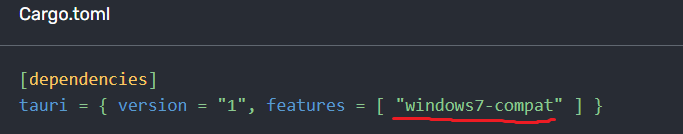
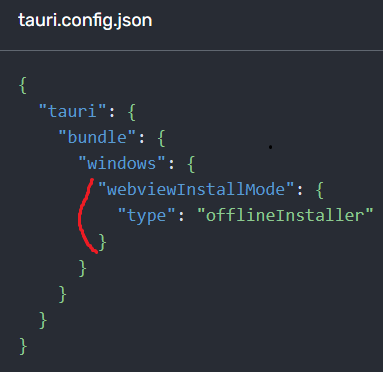
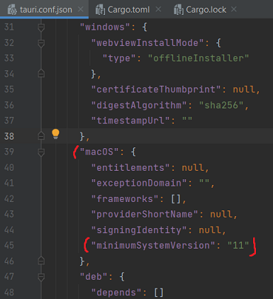

<p align="center">

</p>

<h2 align="center">Redditech - Tauri</h2>
<p>Reddit mobile, web and desktop application created with tauri, vuejs, capacitor, oauth and the reddit api </p>

> Source code for the demo page can be found on the [tauri-reddit-mobile-app repo](https://github.com/Leoglme/tauri-reddit-mobile-app)

<p align="center">

</p>

## Menu

- [Setup Tauri for Windows](#setup-tauri-for-windows)
- [Setup Tauri for macOS](#setup-tauri-for-macos)
- [Setup Tauri for Linux](#setup-tauri-for-linux)
- [Setup for Vue.js](#setup-for-vuejs)
- [Icons - Generate icons for application](#icons---generate-icons-for-application)
- [Updating Dependencies](#updating-dependencies)
- [Check Compile](#check-compile)
- [Test unitaire/e2e](#test-unitairee2e)
- [Test unitaire vitest](#test-unitaire-vitest)
- [Tauri Production](#tauri-production)
- [Capacitor build and run application](#capacitor-build-and-run-application)

## <span>Tech Stack 🛠</span>

- Tauri (framework)
- Vue.js (framework front-end in Tauri)
- Rust (back-end in Tauri)
- NodeJS (environnement)
- Cordova

<br /><br />

## Infos for dependances / environment

It shows a concise list of information about the environment, Rust, Node.js and their versions as well as some relevant configurations.

```bash
npm run tauri:info:dependencies
```

<br /><br />

## Setup Tauri for Windows

1. Install Microsoft Visual Studio 2022 (MSVC v143 + Windows 10 SDK): https://visualstudio.microsoft.com/fr/vs/
2. Install WebView2 (if windows <= 10) : https://developer.microsoft.com/en-us/microsoft-edge/webview2/#download-section
3. Install Rust : https://www.rust-lang.org/tools/install
4. Install targets rust for build/compile Tauri :

```bash
npm run rust:install:target:windows
```

## Setup Tauri for macOS

1. Install macOS et CLang :

```bash
xcode-select --install
```

2. Install Rust :

```bash
#curl
curl --proto '=https' --tlsv1.2 https://sh.rustup.rs -sSf | sh
```

3. Install targets rust for build/compile Tauri :

```bash
npm run rust:install:target:macos
```

## Setup Tauri for Linux

1. Dépendances système (Debian) :

```bash
sudo apt update
sudo apt install libwebkit2gtk-4.0-dev \
    build-essential \
    curl \
    wget \
    libssl-dev \
    libgtk-3-dev \
    libayatana-appindicator3-dev \
    librsvg2-dev
```

2. Install Rust :

```bash
#curl
curl --proto '=https' --tlsv1.2 https://sh.rustup.rs -sSf | sh
```

3. Install targets rust for build/compile Tauri :

```bash
npm run rust:install:target:linux
```

<br /><br />

## Setup for Vue.js

```bash
# npm
# Install Node.js and npm
npm install -g npm
```

```bash
# npm
# Install dependencies
npm install
```

## Icons - Generate icons for application

1. Informations - Type files :

```bash
icon.icns=macOS
icon.ico=Windows
*.png=Linux
Square*Logo.png& StoreLogo.png=Actuellement inutilisé mais destiné aux cibles AppX/MS Store.
```

2. Informations - Icon de base :

```bash
default format: .png
default size : 1024x1024px with transparency
default name file : ./app-icon.png
```

3. Generate icons plateforms all :

```bash
npm run tauri:generate:icon
```

4. Add files path icon in src-tauri/tauri.conf.json.

<br /><br />

## Updating Dependencies

### NPM :

Pour voir les mise à jour des packages disponible de npm :

```bash
# npm
npm run npm:check:dependencies
```

Update depencencies to npm (Vue.js/Tauri) :

```bash
# npm
npm run npm:update:all-packages-major
```

<br />

### Rust :

Update Rust (Rust language) :

```bash
# npm
npm run rust:update

# print version rust (rustc = compiler rust)
npm run rust:print:version
```

<br />

### Cargo :

Pour voir les mise à jour des packages disponible de cargo :

```bash
# npm
# list the installed libraries
npm run cargo:check:dependencies

# npm
# lists installed libraries to see deep details
npm run cargo:check2:dependencies
```

Update depencencies to cargo (Rust/Tauri) :

```bash
# npm
# update just minors
npm run cargo:update:all-packages-minors

# npm
# update minors/major
npm run cargo:update:all-packages-major
```

<br /><br />

## Check Compile

Cette commande vérifie rapidement votre code pour s'assurer qu'il se compile mais ne produit pas d'exécutable et ne lance pas l'application (seulement pour s'assurer que le projet Rust compile) :

```bash
# npm
npm run dev:check-compile
```

Application type : Desktop (.exe)

```bash
# npm
npm run dev:desktop
```

Application type : WebApp <br />
Start the development server on http://localhost:1473/

```bash
# npm
npm run dev:web
```

<br /><br />

## Test unitaire/e2e

### Informations sur Cypress / Vitest et Test unitaire / e2e :

1. Cypress = Test e2e, Cypress est principalement utilisé pour les tests d'interface utilisateur et d'API, ce qui signifie qu'il est plus adapté pour tester le comportement global de votre application, y compris l'interaction de l'utilisateur avec l'interface utilisateur et les appels d'API.<br /><br />
2. Vitest = Test unitaire, test les components de Vue.js. Vitest utilise : Vitest + Vue test utils <br />
   Vitest watch les fichiers de test unitaire (\*.spec.ts) a chaque changement dans le code de vos test unitaire.

### Informations sur les rapports de test générer avec Cypress et Vitest :

1. Cypress/e2e : Les rapports de test sont générer dans le dossier 'cypress/e2e/reports' (il ne sont pas générer avec les command 'npm run test:e2e:dev:..' il faut qu'il sois lancer en mode 'prod'. Le rapport de test générer est un fichier \*.html<br /><br />
2. Vitest/unitaire : Les rapports de test sont générer dans le dossier 'vitest/unit/reports', et le rapport de test générer est un fichier \*.html

### Development :

```sh
# npm
# run test e2e and unit (Cypress / Vitest)
npm run test:unit-e2e:dev:chrome
npm run test:unit-e2e:dev:firefox
npm run test:unit-e2e:dev:edge

# npm
# run test e2e (Cypress)
npm run test:e2e:dev:chrome
npm run test:e2e:dev:firefox
npm run test:e2e:dev:edge

# npm
# run test unit (Vitest)
npm run test:unit:dev
```

### Production :

```sh
# npm
# run test e2e and unit (Cypress / Vitest)
npm run test:unit-e2e:prod:chrome
npm run test:unit-e2e:prod:firefox
npm run test:unit-e2e:prod:edge

# npm
# run test e2e (Cypress)
npm run test:e2e:prod:chrome
npm run test:e2e:prod:firefox
npm run test:e2e:prod:edge

# npm
# run test unit (Vitest)
npm run test:unit:prod
```

<br /><br />

### Test unitaire vitest

```bash
npm run test
npm run test:unit:dev
npm run test:unit:dev:gui
npm run test:unit:prod
```

## Tauri Production

### Install for production - Windows / macOS / Linux :

Par défaut, Rust installe uniquement les chaînes d'outils pour la cible de votre machine. <br />
Vous devez donc d'abord installer la chaîne d'outils pour le system souhaiter. <br /><br />
Exemple pour ajouter/installer la chaine d'outils Windows 32bit :

```bash
rustup target add i686-pc-windows-msvc
```

Supprimer une target spécifique :

```bash
rustup target remove i686-pc-windows-msvc
```

Lister les targets déjà installer :

```bash
rustup target list
```

Targets disponible : https://doc.rust-lang.org/nightly/rustc/platform-support.html

<br />

Il y a toujours une chaine d'outils qui est utilisé par défault, c'est celui qui est choisi lors de la compilation <br />
Pour connaitre la chaine d'outils actuellement utilisé :

```bash
rustup default
```

Pour changer la chaine d'outils par défault utilisé, exemple pour Windows-32bit :

```bash
rustup default stable-i686-pc-windows-msvc
```

<br />

### Réduire la taille de l'application :

Documentation : https://tauri.app/fr/v1/guides/building/app-size#rust-build-time-optimizations <br />

1. Rust Build-Time Optimizations (optimisation lors du build) en ajoutant des données dans le fichier Cargot.toml :

```bash
  [profile.release]
  panic = "abort" # Éliminer la logique de nettoyage de panique coûteuse
  codegen-units = 1 # Compiler les crates l'une après l'autre pour que le compilateur puisse optimiser mieux
  lto = true # Active les optimisations de link
  opt-level = "s" # Optimiser la taille du binaire
  strip = true # Supprimer automatiquement les symboles du binaire.
```

<br />

### Après avoir build, récupérer le binaires et/ou le programme d'installation pour le système d'exploitation ciblé :

Cette commande intègre vos ressources Web dans un seul binaire avec votre code Rust. <br />
Le binaire lui-même sera situé dans : <br />

```bash
src-tauri/target/release/[app name]
```

Et les programmes d'installation seront situés dans :

```bash
src-tauri/target/release/bundle/
```

<br />

### Build - Windows - .msi / .exe :

<span style="color: red;">IMPORTANT</span> : Veuillez noter que les installateurs de .msi ne peuvent être créés que sous Windows car la compilation croisée ne fonctionne pas encore.
<br />

<span style="color: red;">IMPORTANT (2)</span> : Windows 11 sont compatible nativement, mais en-dessous de Windows 11 il n'y as pas WebView2 installer par défault. <br />
Il faudra le packager dans l'installeur .msi pour que ce sois compatible à partir de Windows7 et +.

Dossier src-tauri : <br />




64-bit Windows (Windows 7+) :

```bash
npm run build:windows:x64
```

32-bit Windows (Windows 7+) :

```bash
npm run build:windows:x86
```

<br />

### Build - Linux - .deb / .AppImage :

<span style="color: red;">IMPORTANT</span> : Veuillez noter que les paquets .deb / .appimage ne peuvent être créés que sur Linux car la compilation croisée ne fonctionne pas encore. <br />

<span style="color: red;">IMPORTANT (2)</span> : Compiler un .appimage pour faciliter les utilisateurs. Une application .appimage est similaire à un fichier .exe sur Windows. <br />
<br />

ARM64 Linux (kernel 4.1, glibc 2.17+) :

```bash
npm run build:linux:arm64
```

32-bit Linux (kernel 3.2+, glibc 2.17+) :

```bash
npm run build:linux:x86
```

64-bit Linux (kernel 3.2+, glibc 2.17+) :

```bash
npm run build:linux:x64
```

<br />

### Build - macOS - .app / .dmg :

<span style="color: red;">IMPORTANT</span> : Veuillez noter que les bundles .app et .dmg ne peuvent être créés que sur macOS car la compilation croisée ne fonctionne pas encore. <br />

<span style="color: red;">IMPORTANT (2)</span> : Compiler un .app pour faciliter les utilisateurs. Une application .app est similaire à un fichier .exe sur Windows. <br />

<span style="color: red;">IMPORTANT (3)</span> : La version minimale du système d'exploitation nécessaire pour qu'une application Tauri puisse fonctionner sur macOS est 10.13. Si vous avez besoin du support pour les nouvelles API macOS comme window.print qui n'est pris en charge que depuis la version macOS 11. <br />

Dossier src-tauri : <br />

<br /><br />

ARM64 macOS (11.0+, Big Sur+) :
produit un binaire macOS pour les machines Apple en silicium.

```bash
npm run build:macos:arm64_silicium
```

64-bit macOS (10.7+, Lion+) :
produit un binaire macOS pour les machines Apple basé sur Intel.

```bash
npm run build:macos:x64_intel
```

ARM64/64-bit macOS (11.0+, Big Sur+ / 10.7+, Lion+) :
produit un binaire macOS universel qui s'exécute à la fois sur le silicium Apple et sur les Mac à processeur Intel.

```bash
npm run build:macos:universal
```

Checkout the [deployment documentation](https://tauri.app/v1/guides/building/) for more information.
<br /><br />

### Capacitor build and run application

```bash
npm run android
npm run android:studio
```
